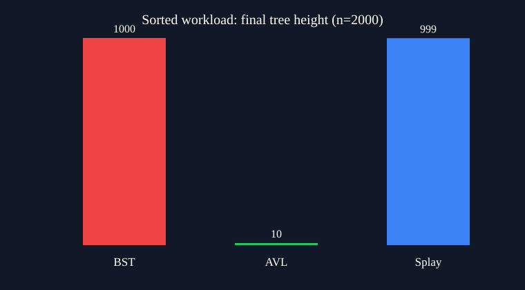

# Experimental Report: BST vs AVL vs Splay

## Method

Each workload was run 5 times for n = 100, 500, 1000, 2000. All trees received exactly the same operation sequence. The random generator has a fixed seed.

## Results at n = 2000

| Workload | Tree | Height | Comparisons | Rotations | Time (ms) |
|---|---:|---:|---:|---:|---:|
| sorted | BST | 1000.0 | 4999000 | 0 | 23.200 |
| sorted | AVL | 10.0 | 56802 | 1992 | 1.200 |
| sorted | Splay | 999.0 | 23509 | 8252 | 0.400 |
| random | BST | 24.0 | 81541 | 0 | 1.000 |
| random | AVL | 11.0 | 61330 | 1845 | 1.600 |
| random | Splay | 22.0 | 115646 | 60559 | 1.800 |
| locality | BST | 1979.0 | 7971541 | 0 | 36.200 |
| locality | AVL | 12.0 | 77083 | 2410 | 1.600 |
| locality | Splay | 992.0 | 25726 | 8181 | 0.200 |

## Interpretation

- Sorted insertion exposes the unbalanced BST worst case: its height grows linearly and comparisons grow quadratically.
- AVL keeps logarithmic height in every workload, paying a bounded number of rotations for predictable operations.
- Splay may end an experiment with a tall tree and an individual operation may be linear; its guarantee concerns the amortized cost of the complete sequence.
- Timing values this small depend on the machine and timer resolution. Structural counts are the primary evidence; timing is supporting evidence.

## Reproducibility

Run `python run_experiments.py` from the project directory. Raw observations are in `raw.csv`; means and sample standard deviations are in `summary.csv`.
